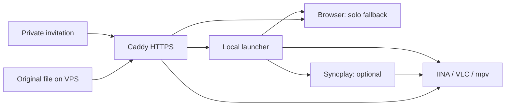

# Watch Link

[](https://github.com/drPod/watch-link/actions/workflows/checks.yml)

**One invitation command. Your existing player. Optional watch-together.**

Watch Link connects Caddy, IINA/VLC/mpv and Syncplay to a private VPS movie library.
It also includes the server configuration for Radarr, Prowlarr, qBittorrent and
Gluetun. Playback, downloads and synchronization stay with those upstream projects.

[Server setup](docs/SERVER.md) · [Browser TV / Jellyfin](docs/JELLYFIN.md) · [Invitations](docs/INVITATIONS.md) ·
[Operations](docs/OPERATIONS.md) · [Verification](docs/VERIFICATION.md) · [Agent guide](AGENTS.md)

## What viewers do

Paste the command supplied by the host into Mac Terminal or Windows PowerShell.
The host can preselect watch-together, so guests need no room names or settings.

| Mode | Existing supported player | No supported player |
|---|---|---|
| Solo (default) | Open it directly | Open the default browser; install nothing |
| Install player | Open it directly | Install IINA on Mac or VLC on Windows |
| Watch together | Launch it through Syncplay | Install a player and Syncplay, then join the room |

On Mac, detection prefers IINA, VLC, then mpv. Windows prefers VLC, then mpv.
Only these known integrations are detected; an arbitrary default video app is not assumed
compatible with Syncplay. Existing VLC/mpv is reused even with the install-player flag.

IINA installation uses Homebrew **only if already installed**, otherwise the official
checksum-pinned DMG. Windows uses WinGet. Syncplay's Mac release uses its official DMG;
macOS may require approval and rerunning the invitation. We do not disable Gatekeeper.
Syncplay runs in the terminal, which must stay open during shared viewing.

Movies stream directly over HTTPS, without server transcoding. Browser codec support,
network speed and the viewing device still determine whether a file plays smoothly and
whether HDR/audio features work. There is no automatic quality downgrade.

## Host quick start

Python 3.12+ and [uv](https://docs.astral.sh/uv/) are required **on the host only**.
Viewers do not need Python, this repository or an SSH account.

```sh
git clone https://github.com/drPod/watch-link.git
cd watch-link
uv sync --locked
```

Deploy the [server stack](docs/SERVER.md), configure Caddy's invitation route, then create
an invitation. Use private paths outside the repository:

```sh
uv run python -m watch_link invite \
  --movie 'https://watch.example.com/PRIVATE_MEDIA_PATH/movie.mp4' \
  --base-url 'https://watch.example.com/i' \
  --output "$HOME/deploy/www/watch-link"
```

Add `--sync` to make an invitation default to watch-together. A random room is generated;
both people should use the **same invitation**. The command prints ready-to-paste Mac
and Windows commands. Treat this output as private.

The server writes two static scripts per invitation. Caddy serves them; no application
server, database, browser extension or new resident daemon is needed.



## Private start page

A basic static page can collect service/workspace links and copyable playback commands.
Use `python -m watch_link.dashboard` with a private config; see [operations](docs/OPERATIONS.md#private-start-page).

## Status

This is an early integration. Mac detection and launcher branches are tested; Windows
runtime and fresh-machine installation require validation on those devices. See the
[verification record](docs/VERIFICATION.md) for tested behavior and remaining limits.
Invitations execute a script on the recipient's computer: inspect it before running.
The short command is not a signed installer or an app-protocol handler.

## Development

```sh
uv sync --locked
uv run ruff check
uv run ruff format --check
uv run mypy
uv run python -m unittest discover -s tests -v
```

Upstream acknowledgements and licenses are listed in [NOTICE.md](NOTICE.md).
Originated in [VPS Workspaces](https://github.com/drPod/vps-workspaces); media-specific
configuration and future launcher development now live here.
